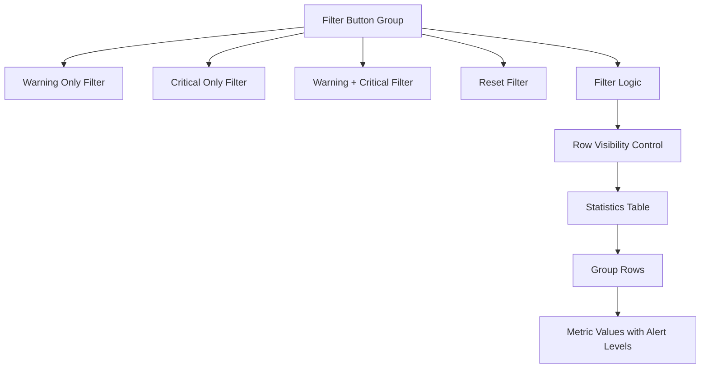

# Быстрые фильтры для страницы статистики

## Обзор

Данный документ описывает реализацию кнопок быстрых фильтров для страницы статистики и сравнения (`E:\workspace\zoomos_v4\src\main\resources\templates\statistics\results.html`). Функция позволит пользователям фильтровать строки таблицы статистики на основе порогов предупреждений и критических отклонений, обеспечивая немедленную видимость групп данных, требующих внимания.

## Технологический стек и зависимости

- **Frontend**: Движок шаблонов Thymeleaf с CSS-фреймворком Bootstrap
- **JavaScript**: Vanilla JS для клиентской логики фильтрации
- **Существующие компоненты**: Текущая таблица статистики, панель настроек порогов и система классификации метрик

## Архитектура компонентов

### Компонент кнопок фильтров
Функциональность быстрых фильтров будет реализована как группа кнопок, расположенная над таблицей статистики.



### Иерархия компонентов
```
Контейнер элементов управления фильтрами
├── Группа кнопок (btn-group)
│   ├── Кнопка "Только предупреждения"
│   ├── Кнопка "Только критические"
│   ├── Кнопка "Предупреждения + критические"
│   └── Кнопка "Сброс"
└── Индикатор активного фильтра
```

### Управление пропсами/состоянием
- **currentWarningThreshold**: Number (наследуется от существующих настроек)
- **currentCriticalThreshold**: Number (наследуется от существующих настроек) 
- **activeFilter**: String ('none', 'warning', 'critical', 'both')
- **filteredGroupsCount**: Number (вычисляется динамически)

## Архитектура логики фильтрации

### Типы фильтров
1. **Только предупреждения**: Показать группы с отклонениями между порогами предупреждения и критическими (10%-20% по умолчанию)
2. **Только критические**: Показать группы с отклонениями выше критического порога (>20% по умолчанию)
3. **Предупреждения + критические**: Показать группы с любыми отклонениями выше порога предупреждения (>10% по умолчанию)
4. **Сброс**: Показать все группы (без фильтрации)

### Классификация на основе порогов
```mermaid
flowchart LR
    A[Metric Value] --> B{Has Change?}
    B -->|No| C[Stable - Hide]
    B -->|Yes| D{Abs(Change) >= Warning?}
    D -->|No| C
    D -->|Yes| E{Abs(Change) >= Critical?}
    E -->|No| F[Warning Level - Show in Warning Filters]
    E -->|Yes| G[Critical Level - Show in Critical Filters]
```

### Стратегия реализации фильтров
Фильтрация будет выполняться на стороне клиента с использованием существующих CSS-классов и JavaScript:

1. **Обнаружение групп**: Определение групп путем проверки строк с метриками, имеющими определенные уровни предупреждений
2. **Группировка строк**: Каждая группа состоит из нескольких строк (одна на метрику), которые имеют общий заголовок группы
3. **Управление видимостью**: Использование CSS `display: none` для скрытия отфильтрованных групп с сохранением структуры таблицы
4. **Обновление счетчиков**: Обновление сводных карточек для отражения отфильтрованных результатов

## Спецификации UI дизайна

### Расположение кнопок фильтров
```html
<div class="filter-controls mb-3">
    <div class="d-flex justify-content-between align-items-center">
        <div class="btn-group" role="group">
            <button type="button" class="btn btn-outline-warning" id="filterWarning">
                <i class="fas fa-exclamation-triangle me-1"></i>
                Только предупреждения (<span id="warningCount">0</span>)
            </button>
            <button type="button" class="btn btn-outline-danger" id="filterCritical">
                <i class="fas fa-exclamation-circle me-1"></i>
                Только критические (<span id="criticalCount">0</span>)
            </button>
            <button type="button" class="btn btn-outline-dark" id="filterBoth">
                <i class="fas fa-filter me-1"></i>
                Все отклонения (<span id="bothCount">0</span>)
            </button>
            <button type="button" class="btn btn-outline-secondary" id="filterReset">
                <i class="fas fa-times me-1"></i>
                Сброс (<span id="totalCount">0</span>)
            </button>
        </div>
        <div class="filter-status text-muted" id="filterStatus">
            Показано: <span id="visibleGroups">0</span> из <span id="totalGroups">0</span> групп
        </div>
    </div>
</div>
```

### CSS стилизация
```css
.filter-controls {
    background-color: var(--bs-gray-100);
    border-radius: 8px;
    padding: 15px;
    margin-bottom: 20px;
}

.btn-group .btn.active {
    box-shadow: 0 0 0 0.2rem rgba(0, 123, 255, 0.25);
}

.filter-status {
    font-size: 0.9rem;
    white-space: nowrap;
}

.group-hidden {
    display: none !important;
}
```

## Реализация JavaScript

### Основные функции фильтрации
```javascript
function initializeQuickFilters() {
    calculateFilterCounts();
    bindFilterEvents();
    updateFilterStatus();
}

function calculateFilterCounts() {
    const groups = document.querySelectorAll('.statistics-table tbody tr.group-start');
    let warningCount = 0, criticalCount = 0, totalCount = groups.length;
    
    groups.forEach(groupRow => {
        const groupMetrics = getGroupMetrics(groupRow);
        if (hasWarningDeviations(groupMetrics)) warningCount++;
        if (hasCriticalDeviations(groupMetrics)) criticalCount++;
    });
    
    // Update button counters
    document.getElementById('warningCount').textContent = warningCount;
    document.getElementById('criticalCount').textContent = criticalCount;
    document.getElementById('bothCount').textContent = warningCount + criticalCount;
    document.getElementById('totalCount').textContent = totalCount;
}

function filterGroups(filterType) {
    const groups = document.querySelectorAll('.statistics-table tbody tr.group-start');
    let visibleCount = 0;
    
    groups.forEach(groupRow => {
        const groupMetrics = getGroupMetrics(groupRow);
        const shouldShow = shouldShowGroup(groupMetrics, filterType);
        
        toggleGroupVisibility(groupRow, shouldShow);
        if (shouldShow) visibleCount++;
    });
    
    updateFilterStatus(visibleCount, groups.length);
    setActiveFilter(filterType);
}
```

### Обнаружение групп и анализ метрик
```javascript
function getGroupMetrics(groupStartRow) {
    const metrics = [];
    let currentRow = groupStartRow;
    
    // Collect all metric rows for this group
    while (currentRow && !currentRow.nextElementSibling?.classList.contains('group-start')) {
        const metricCells = currentRow.querySelectorAll('.metric-decrease-warning, .metric-decrease-critical, .metric-increase-warning, .metric-increase-critical');
        metrics.push(...metricCells);
        currentRow = currentRow.nextElementSibling;
    }
    
    return metrics;
}

function shouldShowGroup(groupMetrics, filterType) {
    switch (filterType) {
        case 'warning':
            return hasWarningOnlyDeviations(groupMetrics);
        case 'critical':
            return hasCriticalDeviations(groupMetrics);
        case 'both':
            return hasAnyDeviations(groupMetrics);
        case 'reset':
        default:
            return true;
    }
}

function hasWarningOnlyDeviations(metrics) {
    return metrics.some(cell => 
        cell.classList.contains('metric-decrease-warning') || 
        cell.classList.contains('metric-increase-warning')
    ) && !hasCriticalDeviations(metrics);
}

function hasCriticalDeviations(metrics) {
    return metrics.some(cell => 
        cell.classList.contains('metric-decrease-critical') || 
        cell.classList.contains('metric-increase-critical')
    );
}
```

### Управление видимостью строк
```javascript
function toggleGroupVisibility(groupStartRow, shouldShow) {
    let currentRow = groupStartRow;
    
    // Hide/show all rows belonging to this group
    while (currentRow && !currentRow.nextElementSibling?.classList.contains('group-start')) {
        currentRow.classList.toggle('group-hidden', !shouldShow);
        currentRow = currentRow.nextElementSibling;
    }
}

function updateFilterStatus(visibleCount, totalCount) {
    document.getElementById('visibleGroups').textContent = visibleCount;
    document.getElementById('totalGroups').textContent = totalCount;
}

function setActiveFilter(filterType) {
    // Remove active state from all buttons
    document.querySelectorAll('.filter-controls .btn').forEach(btn => 
        btn.classList.remove('active')
    );
    
    // Set active state on current filter
    const activeButton = document.getElementById(`filter${filterType.charAt(0).toUpperCase() + filterType.slice(1)}`);
    if (activeButton) activeButton.classList.add('active');
}
```

## Точки интеграции

### Существующая система порогов
Логика фильтров будет использовать существующую систему пересчета порогов:

- **currentWarningThreshold**: Используется для определения отклонений уровня предупреждения
- **currentCriticalThreshold**: Используется для определения критических отклонений  
- **recalculateAlertLevels()**: Будет запускать обновление счетчиков фильтров при изменении порогов

### Интеграция сводных карточек
Обновление существующих функций счетчиков сводки для отражения отфильтрованного состояния:

```javascript
function updateSummaryCounters() {
    // Existing logic for warning/critical counts
    const visibleRows = document.querySelectorAll('.statistics-table tbody tr:not(.group-hidden)');
    const warningCells = visibleRows.querySelectorAll('.metric-increase-warning, .metric-decrease-warning').length;
    const criticalCells = visibleRows.querySelectorAll('.metric-increase-critical, .metric-decrease-critical').length;
    
    // Update cards to show filtered results
    updateCounterCards(warningCells, criticalCells);
}
```

## План реализации

### Фаза 1: UI компоненты
1. Добавить HTML кнопок фильтров над таблицей статистики
2. Реализовать CSS стили для элементов управления фильтрами
3. Добавить обработчики событий для взаимодействия с кнопками

### Фаза 2: Логика фильтрации
1. Реализовать функции обнаружения групп и анализа метрик
2. Создать функциональность переключения видимости строк
3. Добавить управление состоянием фильтров

### Фаза 3: Интеграция
1. Подключить к существующей системе порогов
2. Обновить счетчики сводки для отфильтрованных представлений
3. Добавить индикаторы состояния фильтров

### Фаза 4: Улучшения
1. Сохранить состояние фильтра при изменении порогов
2. Добавить горячие клавиши для быстрой фильтрации
3. Реализовать плавные анимации для скрытия/показа строк

## Стратегия тестирования

### Модульное тестирование
- Тестирование логики фильтров с различными комбинациями метрик
- Проверка корректного обнаружения групп в разных структурах таблиц
- Валидация точности классификации на основе порогов

### Интеграционное тестирование  
- Тестирование взаимодействия с существующей функциональностью настройки порогов
- Проверка обновления счетчиков сводки в отфильтрованном состоянии
- Тестирование сохранения фильтров при операциях с панелью настроек

### Пользовательское приемочное тестирование
- Проверка интуитивного поведения фильтров согласно ожиданиям пользователей
- Тестирование производительности фильтров с большими наборами данных
- Валидация визуальной обратной связи и индикаторов состояния

## Соображения производительности

### Оптимизация на стороне клиента
- **Ленивые вычисления**: Пересчитывать счетчики фильтров только при изменении порогов
- **Кэширование DOM**: Кэшировать ссылки на строки групп во избежание повторных запросов
- **Эффективные селекторы**: Использовать конкретные CSS классы вместо сложного обхода

### Управление памятью
- Избегать хранения большого количества ссылок на DOM
- Очищать обработчики событий при динамическом пересоздании компонентов
- Использовать делегирование событий для лучшей производительности

## Ограничения

### Ограничения текущей реализации
- Фильтрация происходит только на стороне клиента и не влияет на экспорт данных
- Состояние фильтра не сохраняется при обновлении страницы
- Отсутствует интеграция серверной фильтрации для оптимизации производительности

### Возможности для будущих улучшений  
- Интеграция серверной фильтрации для больших наборов данных
- Сохранение состояния фильтра в пользовательских настройках
- Расширенные комбинации фильтров (например, конкретные типы метрик)
- Функциональность экспорта, учитывающая активные фильтры