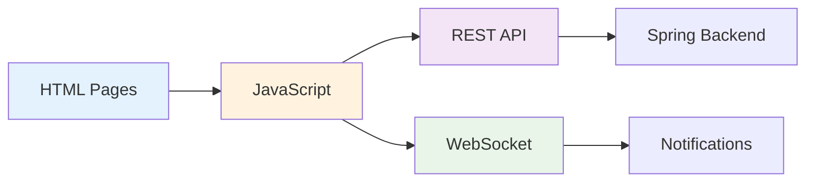

# 🔧 Система обслуживания Zoomos v4 - Техническое описание

> **Полное руководство для разработчиков по системе автоматизированного обслуживания**

## 📋 Содержание

- [Обзор системы](#-обзор-системы)
- [Архитектура](#-архитектура)
- [Компоненты системы](#-компоненты-системы)
- [API Reference](#-api-reference)
- [Веб-интерфейс](#-веб-интерфейс)
- [Автоматизация](#-автоматизация)
- [Конфигурация](#-конфигурация)
- [Развертывание](#-развертывание)
- [Мониторинг и логирование](#-мониторинг-и-логирование)
- [Диагностика проблем](#-диагностика-проблем)

---

## 🎯 Обзор системы

Система обслуживания Zoomos v4 - это комплексное решение для автоматизированного обслуживания приложения обработки файлов. Система включает управление файлами, обслуживание базы данных, мониторинг системы и автоматизацию операций.

### Ключевые возможности

- 📁 **Управление файлами**: архивирование, анализ дискового пространства, поиск дубликатов
- 🗄️ **Обслуживание БД**: очистка старых данных, анализ производительности, проверка целостности
- 🔍 **Мониторинг системы**: проверка состояния, диагностика ресурсов, генерация отчетов
- 🤖 **Автоматизация**: выполнение операций по расписанию с уведомлениями
- 🌐 **Веб-интерфейс**: современный UI для управления всеми операциями

### Технический стек

```yaml
Backend:
  - Spring Boot 3.2.12
  - Java 17
  - PostgreSQL
  - Hibernate/JPA
  - WebSocket (STOMP)

Frontend:
  - Thymeleaf
  - Bootstrap 5.3.0
  - JavaScript (ES6+)
  - Font Awesome

Инфраструктура:
  - Maven
  - Flyway миграции
  - Scheduled tasks
  - Логирование (SLF4J)
```

---

## 🏗️ Архитектура

### Общая архитектура системы

```mermaid
graph TB
    UI[Web Interface] --> MC[MaintenanceController]
    MC --> MS[MaintenanceScheduler]
    MC --> FMS[FileManagementService]
    MC --> DMS[DatabaseMaintenanceService] 
    MC --> SHS[SystemHealthService]
    MS --> FMS
    MS --> DMS
    MS --> SHS
    MS --> NS[NotificationService]
    NS --> WS[WebSocket]
    FMS --> FS[File System]
    DMS --> DB[(PostgreSQL)]
    SHS --> SYS[System Resources]
    
    style UI fill:#e1f5fe
    style MC fill:#f3e5f5
    style MS fill:#fff3e0
    style DB fill:#e8f5e8
    style FS fill:#fce4ec
```



### Структура пакетов

```
src/main/java/com/java/
├── controller/
│   └── MaintenanceController.java         # REST API + HTML endpoints
├── service/
│   ├── MaintenanceSchedulerService.java  # Автоматизация
│   ├── MaintenanceNotificationService.java # Уведомления
│   └── maintenance/
│       ├── FileManagementService.java    # Управление файлами
│       ├── DatabaseMaintenanceService.java # Обслуживание БД
│       └── SystemHealthService.java      # Диагностика системы
├── dto/
│   ├── maintenance/                       # DTO для системы обслуживания
└── config/
    └── AsyncConfig.java                   # Конфигурация async tasks
```

---

## 🔧 Компоненты системы

### 1. FileManagementService

**Назначение**: Управление файлами и дисковым пространством

**Основные методы**:
```java
// Анализ дискового пространства
List<DirectoryStatsDto> analyzeDiskSpace()

// Архивирование старых файлов (старше N дней)
ArchiveResultDto archiveOldFiles(int olderThanDays)

// Поиск дублирующихся файлов
List<DuplicateFileDto> findDuplicateFiles()

// Проверка доступности директорий
boolean checkDirectoriesAvailable()
```

**Пример использования**:
```java
@Autowired
private FileManagementService fileService;

// Архивировать файлы старше 30 дней
ArchiveResultDto result = fileService.archiveOldFiles(30);
if (result.isSuccess()) {
    log.info("Архивировано {} файлов, размер: {}", 
        result.getArchivedFiles(), result.getFormattedArchivedSize());
}
```

**Расположение**: [`FileManagementService.java:1`](../src/main/java/com/java/service/maintenance/FileManagementService.java)

### 2. DatabaseMaintenanceService

**Назначение**: Обслуживание и оптимизация базы данных

**Основные методы**:
```java
// Очистка старых данных
CleanupResultDto cleanupOldData()

// Анализ производительности запросов
List<QueryPerformanceDto> analyzeQueryPerformance()

// Получение статистики БД
DatabaseStatsDto getDatabaseStats()

// Проверка целостности данных
List<DataIntegrityIssueDto> checkDataIntegrity()
```

**Конфигурация**:
```properties
# Возраст данных для очистки (дни)
database.maintenance.cleanup.old-data.days=30

# Порог медленных запросов (мс)
database.maintenance.performance.slow-query-threshold=1000

# Включение проверки целостности
database.maintenance.integrity.check.enabled=true
```

**Расположение**: [`DatabaseMaintenanceService.java:1`](../src/main/java/com/java/service/maintenance/DatabaseMaintenanceService.java)

### 3. SystemHealthService

**Назначение**: Мониторинг состояния системы и диагностика

**Основные методы**:
```java
// Комплексная проверка системы
SystemHealthDto checkSystemHealth()

// Мониторинг ресурсов системы
SystemResourcesDto getSystemResources()

// Генерация диагностического отчета
SystemReportDto generateSystemReport()
```

**Пример ответа**:
```json
{
  "overallStatus": "HEALTHY",
  "systemScore": 95.0,
  "componentStatuses": {
    "database": "CONNECTED",
    "memory": "OK", 
    "disk": "OK",
    "cpu": "OK"
  },
  "recommendation": "Система работает в штатном режиме",
  "formattedUptime": "2 ч 30 мин"
}
```

**Расположение**: [`SystemHealthService.java:1`](../src/main/java/com/java/service/maintenance/SystemHealthService.java)

### 4. MaintenanceSchedulerService

**Назначение**: Автоматизация операций обслуживания по расписанию

**Scheduled задачи**:
```java
// Ежедневное архивирование файлов в 02:00
@Scheduled(cron = "${maintenance.scheduler.file-archive.cron:0 0 2 * * *}")
public void scheduleFileArchiving()

// Еженедельная очистка БД в воскресенье 03:00  
@Scheduled(cron = "${maintenance.scheduler.database-cleanup.cron:0 0 3 * * SUN}")
public void scheduleDatabaseCleanup()

// Ежечасная проверка системы
@Scheduled(cron = "${maintenance.scheduler.health-check.cron:0 0 * * * *}")
public void scheduleHealthCheck()

// Ежемесячное полное обслуживание 1-го числа в 04:00
@Scheduled(cron = "${maintenance.scheduler.full-maintenance.cron:0 0 4 1 * *}")
public void scheduleFullMaintenance()
```

**Условная активация**:
```java
@ConditionalOnProperty(
    value = "maintenance.scheduler.enabled", 
    havingValue = "true", 
    matchIfMissing = false
)
```

**Расположение**: [`MaintenanceSchedulerService.java:1`](../src/main/java/com/java/service/MaintenanceSchedulerService.java)

### 5. MaintenanceNotificationService

**Назначение**: Система уведомлений через WebSocket

**Основные методы**:
```java
// Отправка уведомления о результатах обслуживания
void sendMaintenanceNotification(String title, String message, String type)

// Специализированные методы
void sendSuccessNotification(String title, String message)
void sendWarningNotification(String title, String message) 
void sendErrorNotification(String title, String message)
```

**Интеграция с WebSocket**:
```java
// Отправка в топик /topic/notifications
messagingTemplate.convertAndSend("/topic/notifications", notification);
```

**Расположение**: [`MaintenanceNotificationService.java:1`](../src/main/java/com/java/service/MaintenanceNotificationService.java)

---

## 🌐 API Reference

### REST Endpoints

#### Файловые операции
```http
GET    /maintenance/files/stats           # Статистика файлов
POST   /maintenance/files/archive         # Архивирование файлов
GET    /maintenance/files/duplicates      # Поиск дубликатов
```

#### Операции с БД
```http
GET    /maintenance/database/stats        # Статистика БД
POST   /maintenance/database/cleanup      # Очистка БД
GET    /maintenance/database/performance  # Анализ производительности
```

#### Системная диагностика
```http
GET    /maintenance/system/health         # Состояние системы
GET    /maintenance/system/resources      # Ресурсы системы
GET    /maintenance/system/report         # Диагностический отчет
```

#### Комплексные операции
```http
POST   /maintenance/cleanup               # Полная очистка системы
```

### Примеры запросов

**Получение статистики файлов**:
```bash
curl -X GET http://localhost:8081/maintenance/files/stats \
  -H "Accept: application/json"
```

**Ответ**:
```json
[
  {
    "directoryName": "uploads",
    "totalSizeBytes": 1048576000,
    "formattedSize": "1,0 ГБ", 
    "fileCount": 150,
    "usagePercentage": 0.05,
    "lastModified": "2025-08-30T15:30:00Z",
    "relativePath": "data/upload"
  }
]
```

**Полная очистка системы**:
```bash
curl -X POST http://localhost:8081/maintenance/cleanup \
  -H "Content-Type: application/json"
```

**Ответ**:
```json
{
  "overall": {
    "status": "success",
    "message": "Полная очистка системы завершена успешно"
  },
  "files": {
    "status": "success", 
    "archivedFiles": 25,
    "freedSpaceMb": 150
  },
  "database": {
    "status": "success",
    "deletedRecords": 1200,
    "freedSpaceMb": 50
  },
  "systemHealth": {
    "status": "HEALTHY",
    "score": 98.5,
    "recommendation": "Система работает оптимально"
  }
}
```

---

## 🎨 Веб-интерфейс

### Структура страниц

```
/maintenance                    # Главная панель
├── /files                     # Управление файлами  
├── /database                  # Обслуживание БД
├── /system                    # Диагностика системы
└── /operations               # Ручные операции
```

### Технологии UI

- **Bootstrap 5.3.0**: Responsive дизайн и компоненты
- **Font Awesome 6.4.0**: Иконки
- **JavaScript ES6+**: Асинхронное взаимодействие с API
- **WebSocket/STOMP**: Real-time уведомления

### Архитектура фронтенда



### Пример интеграции

**HTML шаблон** ([`maintenance/index.html:1`](../src/main/resources/templates/maintenance/index.html)):
```html
<div class="card maintenance-card">
  <div class="card-body text-center">
    <i class="fas fa-database fa-3x text-success"></i>
    <h5>Обслуживание БД</h5>
    <p>Очистка старых данных, анализ производительности</p>
    <a href="/maintenance/database" class="btn btn-success">
      <i class="fas fa-arrow-right"></i> Перейти
    </a>
  </div>
</div>
```

**JavaScript интеграция**:
```javascript
// Выполнение операции через API
async function executeOperation(button, title, url, options = {}) {
  const originalText = button.innerHTML;
  button.disabled = true;
  button.innerHTML = '<i class="fas fa-spinner fa-spin"></i> Выполнение...';
  
  try {
    const response = await fetch(url, options);
    const data = await response.json();
    
    addOperationResult(title, formatResult(data), 
      response.ok ? 'success' : 'danger');
  } catch (error) {
    addOperationResult(title, `Ошибка: ${error.message}`, 'danger');
  } finally {
    button.disabled = false;
    button.innerHTML = originalText;
  }
}
```

---

## 🤖 Автоматизация

### Конфигурация расписаний

**Основные настройки** ([`application.properties:100`](../src/main/resources/application.properties)):
```properties
# Включение планировщика обслуживания
maintenance.scheduler.enabled=true

# Ежедневное архивирование файлов в 02:00
maintenance.scheduler.file-archive.cron=0 0 2 * * *

# Еженедельная очистка БД каждое воскресенье в 03:00
maintenance.scheduler.database-cleanup.cron=0 0 3 * * SUN

# Ежечасная проверка состояния системы  
maintenance.scheduler.health-check.cron=0 0 * * * *

# Еженедельный анализ производительности каждый понедельник в 01:00
maintenance.scheduler.performance-analysis.cron=0 0 1 * * MON

# Ежемесячное полное обслуживание 1-го числа в 04:00
maintenance.scheduler.full-maintenance.cron=0 0 4 1 * *
```

### Профили среды

**Разработка** ([`application-dev.properties:37`](../src/main/resources/application-dev.properties)):
```properties
# Отключение планировщика в разработке (по умолчанию)
maintenance.scheduler.enabled=false

# Тестовые расписания (более частые интервалы)
maintenance.scheduler.file-archive.cron=0 */5 * * * *
maintenance.scheduler.health-check.cron=0 */2 * * * *
```

**Продакшн** ([`application-prod.properties:79`](../src/main/resources/application-prod.properties)):
```properties
# Активация планировщика в продакшене
maintenance.scheduler.enabled=true

# Консервативные расписания для минимального влияния
maintenance.scheduler.health-check.cron=0 0 */2 * * *
```

### Уведомления

Система автоматически отправляет уведомления о результатах операций:

```java
// Успешное выполнение
notificationService.sendMaintenanceNotification(
  "Архивирование файлов", 
  "Успешно архивировано 15 файлов (2,5 МБ)",
  "success"
);

// Критическая ситуация
notificationService.sendMaintenanceNotification(
  "КРИТИЧЕСКАЯ СИТУАЦИЯ", 
  "Использование памяти: 95% (критический уровень)",
  "error"
);
```

---

## ⚙️ Конфигурация

### Основные настройки

**Система обслуживания**:
```properties
# === АВТОМАТИЗАЦИЯ ===
maintenance.scheduler.enabled=true
maintenance.notifications.enabled=true
maintenance.notifications.websocket.enabled=true

# === ФАЙЛОВАЯ СИСТЕМА ===  
file.management.archive.enabled=true
file.management.archive.max.size.gb=5
file.management.duplicate.scan.enabled=true

# === БАЗА ДАННЫХ ===
database.maintenance.cleanup.old-data.days=30
database.maintenance.performance.slow-query-threshold=1000
database.maintenance.integrity.check.enabled=true
database.maintenance.auto-cleanup.enabled=true

# === МОНИТОРИНГ ===
system.health.cpu.warning-threshold=80.0
system.health.memory.warning-threshold=85.0  
system.health.disk.warning-threshold=90.0
system.health.database.connection-timeout=5000
```

### Профили производительности

**Продакшн оптимизация**:
```properties
# Connection Pool оптимизация
spring.datasource.hikari.maximum-pool-size=20
spring.datasource.hikari.minimum-idle=5
spring.datasource.hikari.idle-timeout=300000

# Hibernate batch processing
spring.jpa.properties.hibernate.jdbc.batch_size=50
spring.jpa.properties.hibernate.order_inserts=true
spring.jpa.properties.hibernate.order_updates=true

# Файловое логирование
logging.file.name=logs/maintenance-prod.log
logging.file.max-size=100MB
logging.file.max-history=30
```

---

## 🚀 Развертывание

### Требования к системе

```yaml
Минимальные:
  - Java: 17+
  - RAM: 2GB
  - Disk: 10GB свободного места
  - PostgreSQL: 12+

Рекомендуемые:
  - Java: 17
  - RAM: 4GB+  
  - Disk: 50GB+
  - PostgreSQL: 14+
  - CPU: 2+ cores
```

### Процедура развертывания

1. **Сборка приложения**:
```bash
# Сборка JAR файла
mvn clean package -DskipTests

# Результат: target/file-processing-app-1.0-SNAPSHOT.jar
```

2. **Конфигурация БД**:
```sql
-- Создание базы данных
CREATE DATABASE zoomos_v4;
CREATE USER zoomos_user WITH PASSWORD 'secure_password';
GRANT ALL PRIVILEGES ON DATABASE zoomos_v4 TO zoomos_user;
```

3. **Настройка application.properties**:
```properties
# Продакшн БД
spring.datasource.url=jdbc:postgresql://localhost:5432/zoomos_v4
spring.datasource.username=zoomos_user
spring.datasource.password=secure_password

# Активация автоматизации
maintenance.scheduler.enabled=true

# Профиль
spring.profiles.active=prod
```

4. **Запуск приложения**:
```bash
# Запуск с продакшн профилем
java -jar file-processing-app-1.0-SNAPSHOT.jar \
  --spring.profiles.active=prod \
  --server.port=8081
```

5. **Проверка развертывания**:
```bash
# Health check
curl http://localhost:8081/maintenance/system/health

# Проверка веб-интерфейса
open http://localhost:8081/maintenance
```

### Docker развертывание (опционально)

**Dockerfile**:
```dockerfile
FROM openjdk:17-jre-slim

COPY target/file-processing-app-1.0-SNAPSHOT.jar app.jar

EXPOSE 8081

ENTRYPOINT ["java", "-jar", "/app.jar"]
```

**docker-compose.yml**:
```yaml
version: '3.8'
services:
  app:
    build: .
    ports:
      - "8081:8081"
    environment:
      - SPRING_PROFILES_ACTIVE=prod
      - SPRING_DATASOURCE_URL=jdbc:postgresql://db:5432/zoomos_v4
    depends_on:
      - db
      
  db:
    image: postgres:14
    environment:
      - POSTGRES_DB=zoomos_v4
      - POSTGRES_USER=zoomos_user
      - POSTGRES_PASSWORD=secure_password
    volumes:
      - postgres_data:/var/lib/postgresql/data

volumes:
  postgres_data:
```

---

## 📊 Мониторинг и логирование

### Структура логирования

**Уровни логирования по компонентам**:
```properties
# Основные сервисы обслуживания
logging.level.com.java.service.maintenance.FileManagementService=INFO
logging.level.com.java.service.maintenance.DatabaseMaintenanceService=INFO  
logging.level.com.java.service.maintenance.SystemHealthService=INFO

# Планировщик (детальное логирование)
logging.level.com.java.service.MaintenanceSchedulerService=INFO
logging.level.com.java.service.MaintenanceNotificationService=INFO

# SQL запросы (только в dev)
logging.level.org.hibernate.SQL=ERROR
```

### Пример логов

**Successful операция**:
```
2025-08-30 02:00:00.123 [pool-1-thread-1] INFO  c.j.s.MaintenanceSchedulerService - 
  Запуск планового архивирования файлов: 2025-08-30 02:00:00

2025-08-30 02:00:15.456 [pool-1-thread-1] INFO  c.j.s.MaintenanceSchedulerService - 
  Плановое архивирование завершено: архивировано 25 файлов, размер: 2,5 МБ

2025-08-30 02:00:15.789 [pool-1-thread-1] INFO  c.j.s.MaintenanceNotificationService - 
  УВЕДОМЛЕНИЕ [Архивирование файлов]: Успешно архивировано 25 файлов (2,5 МБ)
```

**Warning уведомление**:
```
2025-08-30 14:00:00.321 [pool-1-thread-2] WARN  c.j.s.MaintenanceSchedulerService - 
  Обнаружены проблемы в системе: статус = WARNING, оценка = 75.0

2025-08-30 14:00:00.654 [pool-1-thread-2] WARN  c.j.s.MaintenanceNotificationService - 
  ПРЕДУПРЕЖДЕНИЕ [Предупреждение системы]: Состояние: WARNING, Оценка: 75.0
```

### Мониторинг системы

**Ключевые метрики**:
```json
{
  "systemHealth": {
    "overallStatus": "HEALTHY",
    "systemScore": 95.0,
    "components": {
      "database": "CONNECTED",
      "memory": "OK",
      "disk": "OK", 
      "cpu": "OK"
    }
  },
  "resources": {
    "memoryUsagePercent": 45.2,
    "diskUsagePercent": 67.8,
    "cpuUsagePercent": 23.1,
    "formattedUsedMemory": "1,8 ГБ",
    "formattedTotalMemory": "4,0 ГБ"
  }
}
```

### WebSocket уведомления

**Подключение к топику**:
```javascript
// Подключение к WebSocket уведомлениям
const stompClient = new StompJs.Client({
  brokerURL: 'ws://localhost:8081/ws'
});

stompClient.onConnect = function (frame) {
  stompClient.subscribe('/topic/notifications', function (notification) {
    const data = JSON.parse(notification.body);
    showNotification(data.title, data.message, data.type);
  });
};
```

---

## 🔍 Диагностика проблем

### Частые проблемы и решения

#### 1. SQL ошибки "столбец не существует"

**Симптомы**:
```
WARN DatabaseMaintenanceService - Не удалось удалить старые сессии: 
JDBC exception executing SQL [DELETE FROM import_sessions WHERE created_at < ?] 
[ОШИБКА: столбец "created_at" не существует]
```

**Решение**:
Проверить правильность имен колонок в SQL запросах. В схеме БД используется `started_at`, а не `created_at`.

#### 2. Scheduler не запускается

**Симптомы**: Отсутствуют логи выполнения scheduled задач

**Решение**:
```properties
# Убедиться что планировщик включен
maintenance.scheduler.enabled=true

# Проверить что @EnableScheduling есть в Main.java
@SpringBootApplication
@EnableScheduling  # <-- Должно быть включено
public class Main { ... }
```

#### 3. WebSocket уведомления не работают

**Симптомы**: Уведомления не появляются в UI

**Диагностика**:
```javascript
// Проверка подключения в browser console
console.log('WebSocket состояние:', stompClient.connected);

// Проверка подписки
stompClient.subscribe('/topic/notifications', function(message) {
  console.log('Получено уведомление:', message.body);
});
```

#### 4. Высокое использование памяти

**Симптомы**: `memoryUsagePercent > 90%`

**Решение**:
```properties
# Оптимизация JVM
-Xmx2g -Xms1g

# Hibernate batch optimization
spring.jpa.properties.hibernate.jdbc.batch_size=50
spring.jpa.properties.hibernate.order_inserts=true
```

### Диагностические endpoints

```bash
# Проверка состояния системы
curl http://localhost:8081/maintenance/system/health

# Генерация диагностического отчета  
curl http://localhost:8081/maintenance/system/report

# Статистика БД
curl http://localhost:8081/maintenance/database/stats

# Анализ производительности
curl http://localhost:8081/maintenance/database/performance
```

### Логи для диагностики

**Включение детального логирования**:
```properties
# Планировщик
logging.level.com.java.service.MaintenanceSchedulerService=DEBUG

# SQL запросы
logging.level.org.hibernate.SQL=DEBUG
logging.level.org.hibernate.type.descriptor.sql.BasicBinder=DEBUG

# WebSocket
logging.level.org.springframework.web.socket=DEBUG
```

---

## 📚 Справочная информация

### Полезные ссылки

- **Конфигурация**: [`application.properties`](../src/main/resources/application.properties)
- **План разработки**: [`tasklist.md`](./tasklist.md) 
- **База данных**: Миграции в [`db/migration/`](../src/main/resources/db/migration/)
- **Веб-шаблоны**: [`templates/maintenance/`](../src/main/resources/templates/maintenance/)

### Команды для разработки

```bash
# Сборка и запуск
mvn clean compile
mvn spring-boot:run -Dspring-boot.run.profiles=silent

# Тестирование API
curl -X GET http://localhost:8081/maintenance/system/health
curl -X POST http://localhost:8081/maintenance/cleanup

# Просмотр логов
tail -f logs/zoomos-v4.log

# Мониторинг БД
psql -d zoomos_v4 -c "SELECT COUNT(*) FROM file_operations;"
```

### Cron expressions справочник

```bash
# Каждый день в 2:00
0 0 2 * * *

# Каждое воскресенье в 3:00  
0 0 3 * * SUN

# Каждый час
0 0 * * * *

# Каждый понедельник в 1:00
0 0 1 * * MON

# 1-го числа каждого месяца в 4:00
0 0 4 1 * *

# Каждые 5 минут (для тестирования)
0 */5 * * * *
```

---

## ✅ Чек-лист для новых разработчиков

- [ ] Установлен Java 17+
- [ ] Настроен PostgreSQL
- [ ] Проект успешно собирается (`mvn clean compile`)
- [ ] Приложение запускается на порту 8081
- [ ] Доступен веб-интерфейс http://localhost:8081/maintenance
- [ ] API endpoints отвечают корректно
- [ ] Понятна структура пакетов и компонентов
- [ ] Изучены основные конфигурационные файлы
- [ ] Протестирована базовая функциональность

---

**📝 Документ создан**: 30.08.2025  
**🔄 Последнее обновление**: 30.08.2025  
**👨‍💻 Автор**: Claude Code Assistant  
**📖 Версия**: 1.0

> 💡 **Совет**: Начните изучение с веб-интерфейса `/maintenance`, затем изучите REST API, и наконец - исходный код сервисов в порядке: FileManagementService → DatabaseMaintenanceService → SystemHealthService → MaintenanceSchedulerService.