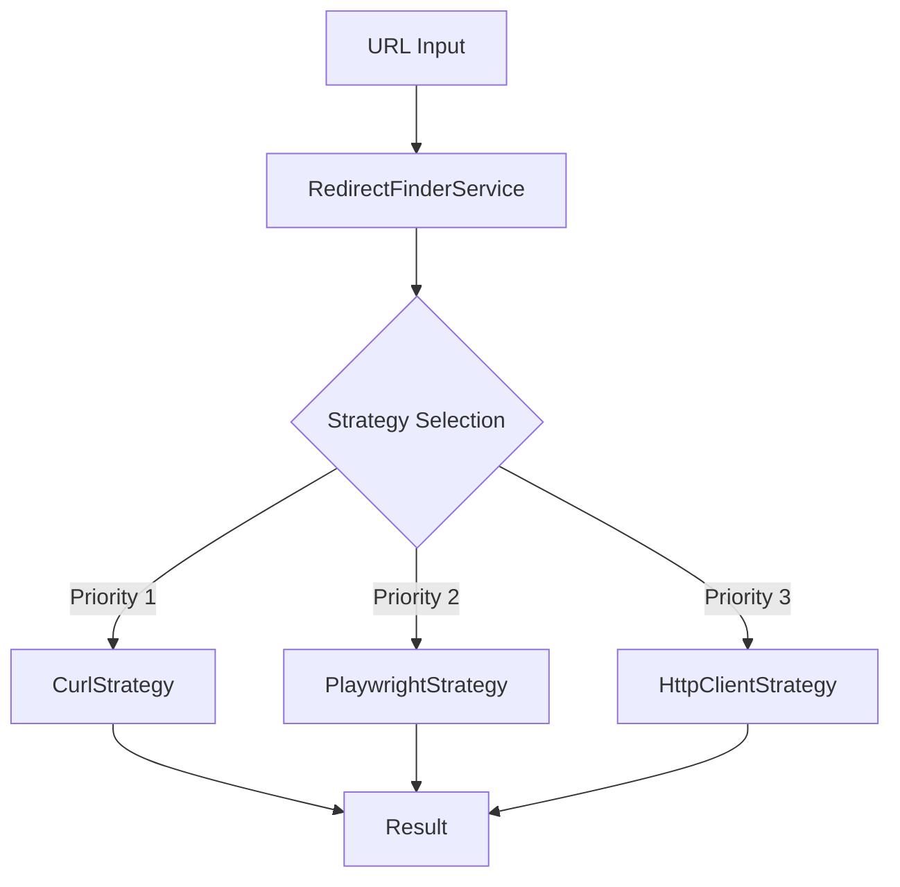

# HTTP Redirect Utility - Техническая документация

## 📋 Обзор проекта

HTTP Redirect Utility - это модуль системы Zoomos v4, предназначенный для автоматического разрешения HTTP редиректов и получения финальных URL после цепочки перенаправлений. Утилита интегрирована в существующую архитектуру Spring Boot приложения и предоставляет веб-интерфейс для загрузки файлов и получения результатов.

### 🎯 Основная задача

**Проблема**: При работе с сокращенными ссылками (QR-коды, короткие ссылки) необходимо получить финальный URL после всех редиректов.

**Решение**: Утилита автоматически следует по цепочке HTTP редиректов (301, 302, 307, 308) и возвращает финальную ссылку с информацией о количестве переходов и статусе.

**Пример работы**:
```
Входящий URL: https://goldapple.ru/qr/19000180719
HTTP 301 → Финальный URL: https://goldapple.ru/19000180719-elixir-precious
```

---

## 🏗️ Архитектура решения

### Паттерн Strategy для обхода антиботных систем

Утилита использует **Strategy Pattern** с тремя стратегиями обработки URL:



### Структура ключевых компонентов

```
src/main/java/com/java/
├── controller/utils/
│   └── RedirectFinderController.java         # REST контроллер веб-интерфейса
├── service/utils/
│   ├── RedirectFinderService.java            # Основной сервис бизнес-логики
│   └── redirect/
│       ├── AsyncRedirectService.java         # Асинхронная обработка
│       ├── CurlStrategy.java                 # Стратегия с системным curl
│       ├── PlaywrightStrategy.java           # Стратегия с браузером
│       ├── HttpClientStrategy.java           # Стратегия с Java HTTP Client
│       └── RedirectProgressDto.java          # DTO для прогресса обработки
├── model/utils/
│   ├── RedirectResult.java                   # Результат обработки URL
│   ├── RedirectExportTemplate.java           # Шаблон для экспорта
│   ├── RedirectProcessingRequest.java        # Запрос на обработку
│   └── RedirectUrlData.java                  # Данные URL с метаинформацией
└── dto/utils/
    └── RedirectFinderDto.java                # DTO конфигурации формы
```

---

## 🔧 Технические стратегии

### 1. CurlStrategy (Приоритет 1)

**Назначение**: Основная стратегия, использует системную команду `curl` для максимальной совместимости.

**Код реализации**:
```java
// src/main/java/com/java/service/utils/redirect/CurlStrategy.java:45-70
private RedirectResult followRedirectsManually(String currentUrl, int maxRedirects, int timeoutMs, long startTime) throws Exception {
    String originalUrl = currentUrl;
    int redirectCount = 0;
    Integer initialRedirectCode = null; // Сохраняем первоначальный HTTP код редиректа
    
    for (int i = 0; i <= maxRedirects; i++) {
        // Получаем заголовки с помощью curl -I (без флага -w)
        String[] headerCommand = {
            "curl", "-I", "-s", 
            "--connect-timeout", "5", "--max-time", String.valueOf(timeoutMs / 1000),
            "--insecure", currentUrl
        };
        
        ProcessBuilder pb = new ProcessBuilder(headerCommand);
        Process process = pb.start();
        
        String result = readProcessOutput(process.getInputStream());
        int exitCode = process.waitFor();
        
        if (exitCode != 0) {
            throw new Exception("Curl завершился с кодом: " + exitCode);
        }
        
        int httpCode = extractHttpCode(result);
        
        if (httpCode >= 300 && httpCode < 400) {
            String location = extractLocation(result);
            if (location != null && !location.isEmpty()) {
                // Сохраняем первоначальный HTTP код редиректа
                if (initialRedirectCode == null) {
                    initialRedirectCode = httpCode;
                }
                redirectCount++;
                String nextUrl = resolveUrl(currentUrl, location);
                currentUrl = nextUrl;
                continue;
            }
        }
        
        // Достигли финального URL
        break;
    }
    
    // Используем первоначальный HTTP код редиректа, если он был, иначе финальный
    int reportHttpCode = (initialRedirectCode != null) ? initialRedirectCode : httpCode;
    
    return RedirectResult.builder()
        .originalUrl(originalUrl)
        .finalUrl(currentUrl)
        .redirectCount(redirectCount)
        .httpStatusCode(reportHttpCode)
        .processingTimeMs(System.currentTimeMillis() - startTime)
        .status(determinePageStatus(reportHttpCode))
        .build();
}
```

**Критическая особенность**: User-Agent НЕ используется, так как многие сайты (включая goldapple.ru) блокируют редиректы при наличии браузерного User-Agent.

### 2. PlaywrightStrategy (Приоритет 2)

**Назначение**: Использует headless браузер для обхода JavaScript редиректов и антиботных систем.

**Код интеграции**:
```java
// src/main/java/com/java/service/utils/redirect/PlaywrightStrategy.java:30-55
@Override
public RedirectResult processRedirect(String url, int maxRedirects, int timeoutMs) {
    long startTime = System.currentTimeMillis();
    
    try (Playwright playwright = Playwright.create()) {
        Browser browser = playwright.chromium().launch(new BrowserType.LaunchOptions().setHeadless(true));
        Page page = browser.newPage();
        
        // Отслеживание редиректов через навигацию
        List<String> urls = new ArrayList<>();
        urls.add(url);
        
        page.onResponse(response -> {
            if (response.status() >= 300 && response.status() < 400) {
                String location = response.headers().get("location");
                if (location != null) {
                    urls.add(location);
                }
            }
        });
        
        Response response = page.navigate(url, new Page.NavigateOptions().setTimeout(timeoutMs));
        String finalUrl = page.url();
        
        return RedirectResult.builder()
            .originalUrl(url)
            .finalUrl(finalUrl)
            .redirectCount(urls.size() - 1)
            .httpStatusCode(response.status())
            .processingTimeMs(System.currentTimeMillis() - startTime)
            .status(PageStatus.OK)
            .build();
    }
}
```

**Зависимость**:
```xml
<!-- pom.xml -->
<dependency>
    <groupId>com.microsoft.playwright</groupId>
    <artifactId>playwright</artifactId>
    <version>1.40.0</version>
</dependency>
```

---

## ⚡ Асинхронная обработка

### Архитектура async обработки

Утилита интегрирована с существующей системой асинхронной обработки проекта:

```java
// src/main/java/com/java/config/AsyncConfig.java:128-148
@Bean(name = "redirectTaskExecutor")
public Executor redirectTaskExecutor() {
    ThreadPoolTaskExecutor executor = new ThreadPoolTaskExecutor();
    executor.setCorePoolSize(1);
    executor.setMaxPoolSize(3);
    executor.setQueueCapacity(5);
    executor.setThreadNamePrefix("RedirectExecutor-");
    executor.setRejectedExecutionHandler(new ThreadPoolExecutor.CallerRunsPolicy());
    executor.setWaitForTasksToCompleteOnShutdown(true);
    executor.setAwaitTerminationSeconds(600); // 10 минут на завершение для долгих операций
    executor.initialize();
    return executor;
}
```

### WebSocket уведомления

Прогресс обработки передается в реальном времени:

```java
// src/main/java/com/java/service/utils/redirect/AsyncRedirectService.java:77-93
private void sendProgressUpdate(String operationId, String message, int percentage, int total) {
    try {
        RedirectProgressDto progress = new RedirectProgressDto();
        progress.setOperationId(operationId);
        progress.setMessage(message);
        progress.setPercentage(percentage);
        progress.setProcessed(percentage * total / 100);
        progress.setTotal(total);
        progress.setStatus("IN_PROGRESS");
        progress.setTimestamp(LocalDateTime.now());
        
        messagingTemplate.convertAndSend("/topic/redirect-progress/" + operationId, progress);
        
    } catch (Exception e) {
        log.error("Ошибка отправки прогресса для операции {}", operationId, e);
    }
}
```

---

## 📊 Интеграция с системой экспорта

### Использование FileGeneratorService

Утилита полностью интегрирована с существующей системой экспорта файлов проекта:

```java
// src/main/java/com/java/model/utils/RedirectExportTemplate.java:15-35
public static RedirectExportTemplate create(boolean includeId, boolean includeModel, 
                                           String idColumnName, String modelColumnName) {
    return RedirectExportTemplate.builder()
            .fileFormat("CSV")
            .csvEncoding("Windows-1251")      // Кодировка для Excel
            .csvDelimiter(";")                // Разделитель для Excel
            .csvQuoteChar("\"")               // Экранирование кавычками
            .includeId(includeId)
            .includeModel(includeModel)
            .idColumnName(idColumnName != null ? idColumnName : "ID")
            .modelColumnName(modelColumnName != null ? modelColumnName : "Модель")
            .build();
}
```

### Структура экспортируемого файла

**Обязательные колонки**:
- `Исходная ссылка` - входящий URL
- `Финальная ссылка` - URL после всех редиректов  
- `HTTP статус` - первоначальный код редиректа (301, 302, etc.)
- `Количество редиректов` - число переходов
- `Время обработки (мс)` - время выполнения запроса
- `Статус обработки` - результат (OK, ERROR, BLOCKED, etc.)

**Опциональные колонки** (если выбраны):
- `ID` - идентификатор из исходного файла
- `Модель` - модель/категория из исходного файла

---

## 🌐 Веб-интерфейс

### URL-структура

```
/utils                                    # Главная страница утилит
/utils/redirect-finder                    # Загрузка файла
/utils/redirect-finder/configure          # Настройка колонок и параметров
/utils/redirect-finder/process            # Запуск обработки
/utils/redirect-finder/cancel             # Отмена операции
```

### Конфигурация параметров

**HTML форма конфигурации**:
```html
<!-- src/main/resources/templates/utils/redirect-finder-configure.html:207-226 -->
<div class="col-md-6">
    <label class="form-label">
        <i class="fas fa-clock text-warning"></i>
        Задержка между запросами
    </label>
    <select class="form-select" th:field="*{delayMs}">
        <option value="0" selected>Без задержки</option>
        <option value="500">0.5 секунды</option>
        <option value="1000">1 секунда (рекомендуется)</option>
        <option value="2000">2 секунды</option>
        <option value="3000">3 секунды</option>
        <option value="5000">5 секунд</option>
    </select>
    <div class="form-text">
        <i class="fas fa-info-circle"></i>
        Задержка помогает избежать блокировки при обработке большого количества URL
    </div>
</div>
```

**Валидация DTO**:
```java
// src/main/java/com/java/dto/utils/RedirectFinderDto.java:32-35
@Min(value = 0, message = "Задержка не может быть отрицательной")
@Max(value = 30000, message = "Задержка не может превышать 30 секунд")
private Integer delayMs = 0;
```

---

## 🧪 Тестирование

### Модульные тесты

**CurlStrategy тестирование**:
```java
// src/test/java/com/java/service/utils/redirect/CurlStrategyTest.java:25-35
@Test
public void testProcessRedirect_Success() {
    CurlStrategy strategy = new CurlStrategy();
    
    RedirectResult result = strategy.processRedirect("https://httpbin.org/redirect/2", 10, 10000);
    
    assertThat(result).isNotNull();
    assertThat(result.getFinalUrl()).contains("httpbin.org");
    assertThat(result.getRedirectCount()).isGreaterThanOrEqualTo(0);
    assertThat(result.getStatus()).isIn(PageStatus.OK, PageStatus.REDIRECT);
}
```

### Интеграционные тесты

**Тестирование реальных редиректов**:
```java
// src/test/java/com/java/service/utils/RedirectFinderServiceIntegrationTest.java:30-45
@Test
public void testGoldAppleRedirect() {
    // Тест с реальной ссылкой goldapple.ru
    List<RedirectUrlData> urls = List.of(
        RedirectUrlData.builder()
            .url("https://goldapple.ru/qr/19000180719")
            .build()
    );
    
    List<RedirectResult> results = redirectFinderService.processRedirects(
        urls, 5, 10000, 1000, null
    );
    
    assertThat(results).hasSize(1);
    RedirectResult result = results.get(0);
    assertThat(result.getFinalUrl()).contains("elixir-precious");
    assertThat(result.getHttpStatusCode()).isEqualTo(301);
}
```

---

## ⚙️ Конфигурация и развертывание

### Maven зависимости

```xml
<!-- pom.xml -->
<dependency>
    <groupId>com.microsoft.playwright</groupId>
    <artifactId>playwright</artifactId>
    <version>1.40.0</version>
</dependency>
```

### Конфигурация Spring Boot

**Thread Pool настройки**:
```properties
# application.properties (рекомендуемые значения)
redirect.async.core-pool-size=1
redirect.async.max-pool-size=3
redirect.async.queue-capacity=5
redirect.async.timeout-seconds=600
```

### Команды запуска

```bash
# Компиляция проекта
mvn clean compile

# Запуск приложения  
mvn spring-boot:run -Dspring-boot.run.profiles=silent

# Доступ к утилите
http://localhost:8081/utils/redirect-finder
```

---

## 🐛 Решение проблем

### Распространенные ошибки

**1. Проблема с User-Agent блокировкой**
```
Симптом: HTTP 200 вместо ожидаемого HTTP 301
Причина: Сайт блокирует редиректы при браузерном User-Agent
Решение: Убрать --user-agent из curl команды ✅
```

**2. Проблема с парсингом HTTP статуса**
```
Симптом: В результате показывается финальный код (200) вместо первоначального (301)
Причина: Неправильный парсинг первой строки ответа
Решение: Сохранение initialRedirectCode на первом редиректе ✅
```

**3. Файлы не экспортируются**
```
Симптом: Ошибка интеграции с FileGeneratorService
Причина: Неправильное сопоставление полей ExportTemplateField
Решение: Использование setEntityFieldName() вместо setDisplayName() ✅
```

### Отладочные команды

```bash
# Проверка curl команды вручную
curl -I -s --connect-timeout 5 --max-time 10 --insecure https://goldapple.ru/qr/19000180719

# Ожидаемый результат:
# HTTP/1.1 301 Moved Permanently
# Location: https://goldapple.ru/19000180719-elixir-precious

# Проверка работы утилиты через тесты
mvn test -Dtest=RedirectFinderServiceIntegrationTest

# Проверка логов async обработки
tail -f logs/application.log | grep "RedirectExecutor"
```

---

## 🚀 Будущие улучшения

### Возможные расширения функциональности

1. **Пакетная обработка файлов**
   - Поддержка множественных файлов за один раз
   - Параллельная обработка нескольких файлов

2. **Расширенная аналитика**
   - Статистика по доменам
   - Анализ времени ответа серверов
   - Детекция циклических редиректов

3. **Дополнительные форматы экспорта**
   - JSON экспорт для API интеграции
   - XML формат для enterprise систем

4. **Кэширование результатов**
   - Redis кэш для частых URL
   - Локальное кэширование с TTL

### Производительность

**Текущие показатели**:
- ~2 секунды на URL (с задержкой 1 сек)
- ~0.5 секунды на URL (без задержки)
- Поддержка до 20 редиректов на цепочку
- Таймаут по умолчанию: 10 секунд

**Рекомендации по масштабированию**:
- Увеличение max-pool-size для высоких нагрузок
- Использование Redis для кэширования частых URL
- Оптимизация curl таймаутов под конкретные сайты

---

## 📞 Контакты и поддержка

**Разработчик**: Claude Code (Anthropic)
**Версия документации**: 1.0
**Дата создания**: 2025-09-06
**Код проекта**: Zoomos v4 HTTP Redirect Utility

**Файловая структура проекта**:
```
E:\workspace\zoomos_v4\
├── src/main/java/com/java/
│   ├── controller/utils/RedirectFinderController.java
│   ├── service/utils/RedirectFinderService.java
│   ├── service/utils/redirect/
│   ├── model/utils/
│   └── dto/utils/
├── src/main/resources/templates/utils/
├── src/test/java/com/java/service/utils/
└── doc/intro_redirect.md (этот файл)
```

**Для получения помощи**:
1. Изучите логи приложения: `logs/application.log`
2. Запустите тесты: `mvn test -Dtest=*RedirectFinder*`
3. Проверьте конфигурацию в `application.properties`

---

*Документация создана автоматически с помощью Claude Code для проекта Zoomos v4 HTTP Redirect Utility*